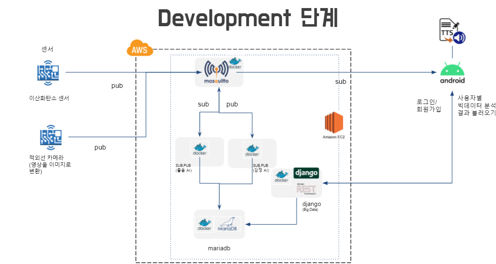
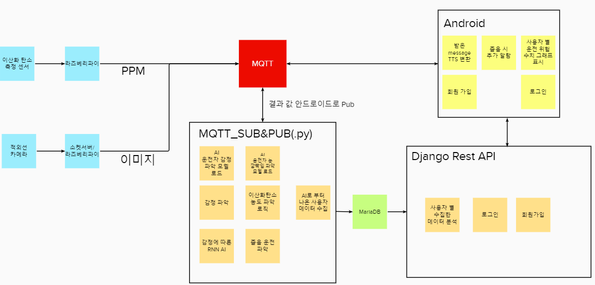
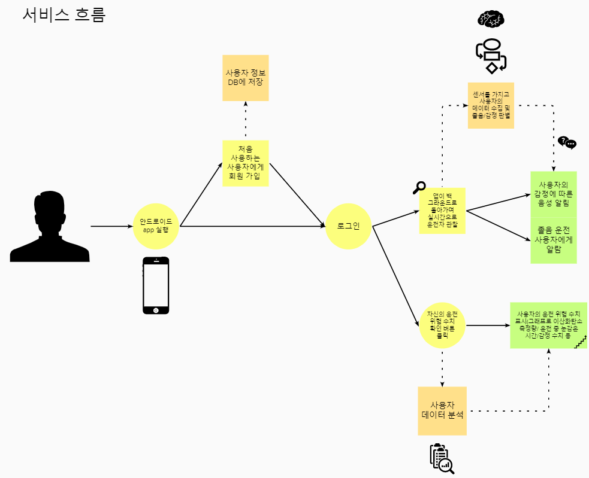

# 멀티캠퍼스 융복합 프로젝트

진행기간 : 2021.4.26 ~ 2021.06.04

주제 : 졸음 운전 판별과 감정 분석을 통한 운전자 보호 시스템

팀명 : ABC다음은 I (5조)

팀원 : 이승호(팀장-AI), 유창호(AI), 김지윤(AI), 박수민(IoT), 김혜림(빅데이터), 김성수(클라우드), 한로빈(클라우드)

### 시연 영상 링크

https://www.youtube.com/watch?v=2D1ZJ71lA8Y

### 파일 내용 정리

* [AI](./AI)
  * AI 모델 관련 코드
* [BigData](./BigData)
  * 데이터 분석 관련 코드
* [DPS](./DPS)
  * 프로젝트 안드로이드 앱 관련 코드
* [IoT](./IoT)
  * 라즈베리파이 및 MQTT 서버에서 사용되는 코드

* 수행일지(주차 보고서)
  * 프로젝트 내 팀원 수행업무 기록
* 융합프로젝트 5조 발표자료
  * [프로젝트 포트폴리오](.융합프로젝트 5조 발표자료.pdf)

### 개발 단계 Architecture

### 시스템 별 기능

### 서비스 흐름도 

### 